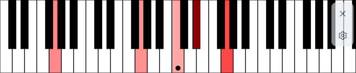

# Overchords

  
  Real-time piano view of the notes being played on your computer.

Overchords shows playing notes from the speaker output in a piano view.

The rust backend uses the cpal library to capture the audio output and uses [Basic-Pitch](https://github.com/spotify/basic-pitch) to detect the notes being played.

# Development

## Building

You'll need Rust and Cargo (install via [rustup.rs](https://rustup.rs/)) and [Bun](https://bun.sh/) to run the application locally.

Install the dependencies: `bun install`

Run the application: `bun tauri dev`

## Publishing a release

Update the version in `src-tauri/Cargo.toml`, `package.json` and `src-tauri/tauri.conf.json`.

Then, add a commit to the `release` branch and push it to the remote repository. The [GitHub Action](`.github/workflows/release.yml`) will automatically build the application for all platforms and create a new release on GitHub with the generated binaries attached. This is a draft release, so you can review it before publishing it. Once you're ready, you can publish the release on GitHub and the binaries will be available for download.
